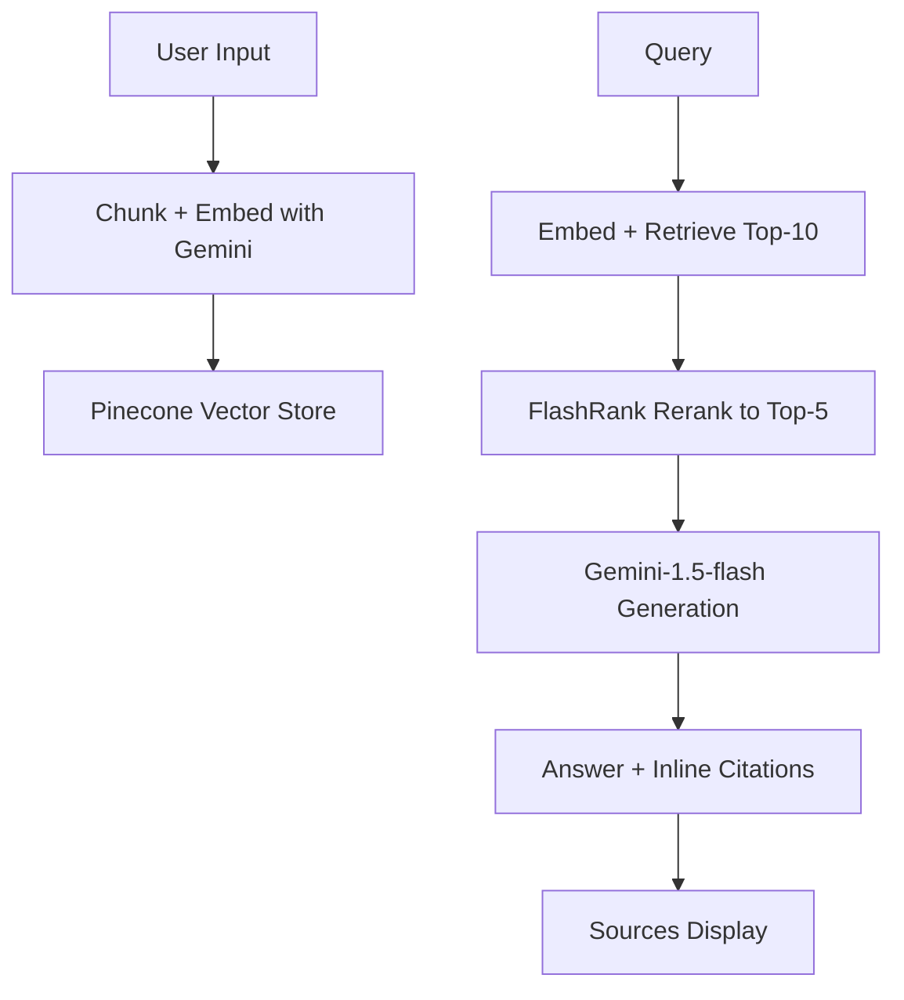

# Mini RAG - Gemini + Pinecone + LangChain

A production-ready retrieval-augmented generation (RAG) application combining Gemini embeddings, Pinecone vector storage, FlashRank reranking, and Streamlit frontend for grounded question-answering with citations.

## Architecture



## Tech Stack

- **Embeddings**: Google Gemini (text-embedding-004, 768-dim, free tier)
- **LLM**: Gemini-1.5-flash (low latency, cost-efficient)
- **Vector Store**: Pinecone serverless (free tier, cosine metric)
- **Reranking**: FlashRank (zero-cost, CPU-based cross-encoder, ~ms latency)
- **Framework**: LangChain (orchestration, chunking, retrieval)
- **Frontend**: Streamlit (simple, interactive, free hosting)

## Setup Instructions

### Step 0: Create API Keys

1. **Google AI Studio**
   - Go to [Google AI Studio](https://aistudio.google.com/)
   - Click "Get API key" → Create new API key
   - Keep it safe

2. **Pinecone**
   - Sign up at [Pinecone](https://www.pinecone.io/)
   - Create a new index:
     - **Name**: `mini-rag`
     - **Dimension**: `768`
     - **Metric**: `cosine`
     - **Cloud**: aws/us-east-1 (or your preferred region)
   - Copy your API key

### Step 1: Environment Setup

```bash
# Clone/navigate to project
cd miniRAG

# Create virtual environment
python -m venv venv

# Activate virtual environment
# Windows
venv\Scripts\activate
# macOS/Linux
source venv/bin/activate

# Install dependencies
pip install -r requirements.txt
```

### Step 2: Configure Secrets

Create a `.env` file in project root (for local development):
```
GOOGLE_API_KEY=your_actual_api_key_here
PINECONE_API_KEY=your_actual_pinecone_key_here
PINECONE_INDEX_NAME=mini-rag
```

Or set environment variables:
```bash
set GOOGLE_API_KEY=your_key  # Windows
export GOOGLE_API_KEY=your_key  # macOS/Linux
```

### Step 3: Run the App

```bash
streamlit run app.py
```

App opens at `http://localhost:8501`

## How It Works

### Document Indexing
1. Upload PDF/TXT or paste text in sidebar
2. Click "Index Document"
3. Text is chunked (1000 chars, 200 overlap)
4. Chunks embedded with Gemini (batch, fast)
5. Vectors upserted to Pinecone with metadata (chunk_id, source)

### Query & Retrieval
1. Enter question
2. Query embedded with Gemini
3. Pinecone retrieves top-10 similar chunks (cosine)
4. FlashRank reranks to top-5 (ultra-fast cross-encoder)
5. Top-5 stuffed into prompt with numbered citations [1], [2], etc.
6. Gemini-1.5-flash generates grounded answer
7. Answer + sources displayed with inline citations

## Configuration

### Chunking Parameters
- `chunk_size=1000`: ~800–1200 tokens (good for Gemini context window)
- `chunk_overlap=200`: Overlap for semantic continuity
- `separators=["\n\n", "\n", " ", ""]`: Hierarchical splitting (paragraphs first)

### Retrieval
- Initial retrieval: `k=10` (top-10 from Pinecone)
- Reranking: `top_n=5` (FlashRank keeps best 5)
- Metric: Cosine similarity (default, fast, robust)

### Generation
- Model: `gemini-1.5-flash`
- Temperature: 0.3 (low, deterministic for grounded answers)
- Prompt: Enforces citation format [1], [2], etc.

## Features

✅ **Text & PDF Upload**: Handles both pasted text and file uploads  
✅ **Fast Indexing**: Batch embedding, ~1k chunks in seconds  
✅ **Smart Reranking**: FlashRank (~5ms per query, zero-cost)  
✅ **Inline Citations**: Answers auto-cite sources as [1], [2]  
✅ **Source Snippets**: Display chunk previews below answer  
✅ **Latency Tracking**: Shows response time per query  
✅ **Fresh Index**: Clears old vectors on new upload (single-doc scope)  

## Project Structure

```
mini-rag/
├── app.py                 # Streamlit app (ingestion + query)
├── requirements.txt       # All dependencies
├── README.md             # This file
├── .streamlit/
│   └── secrets.toml      # Secrets template (fill in keys for hosting)
└── .env                  # Local env vars (gitignore'd)
```

## Hosting on Streamlit Cloud

1. Push to GitHub (public repo)
2. Go to [Streamlit Cloud](https://share.streamlit.io/)
3. Click "New app" → Select repo/branch
4. In "Advanced settings" → Secrets, paste:
   ```toml
   GOOGLE_API_KEY = "your_key"
   PINECONE_API_KEY = "your_key"
   PINECONE_INDEX_NAME = "mini-rag"
   ```
5. Deploy ✅

## Cost & Performance

| Component | Cost | Latency |
|-----------|------|---------|
| Gemini Embeddings | ~$0.025/M tokens (free tier: 60 req/min) | ~200ms |
| Gemini-1.5-flash | ~$0.075/1M input, $0.3/1M output | ~1–2s |
| Pinecone serverless | Free tier: 1M vector ops/month | ~50ms |
| FlashRank reranking | $0 (runs locally) | ~5ms |

**Typical query cost**: ~$0.0001–0.0005 (flash is super cheap)

## Design Trade-offs

| Choice | Why |
|--------|-----|
| FlashRank over Cohere API | Zero cost, fast CPU, no extra key |
| Gemini-1.5-flash over Claude | Lower cost, faster, good quality |
| Single index (clear on reload) | Simpler scope, no multi-user complexity |
| Pinecone serverless | Auto-scales free tier, no server ops |
| LangChain | Abstraction, chunking, metadata, citations |

## Future Enhancements

- [ ] **Chat History**: Maintain conversation context (session_state)
- [ ] **Multi-Doc**: Pinecone namespaces per document
- [ ] **Web Search**: Augment with real-time search fallback
- [ ] **Cost Tracking**: Log token usage + dollars spent
- [ ] **Custom Rerankers**: Cohere/Jina for higher accuracy
- [ ] **Streaming**: Stream generation token-by-token
- [ ] **Auth**: User authentication + rate limiting
- [ ] **Feedback**: Thumbs up/down for RLHF data collection

## Minimal Evaluation

Pick a public PDF (e.g., `attention-is-all-you-need.pdf`), index it, create 5 manual Q/A pairs, test:
- ✅ Answer correctness (grounded in docs)
- ✅ Citations match source chunks
- ✅ No hallucinations
- ✅ Latency < 3s (embed + retrieve + generate)
- ✅ UI/UX smooth

Target: 4/5 grounded correctly = production-ready.

## Troubleshooting

### ❌ "API key not found"
Set `GOOGLE_API_KEY` and `PINECONE_API_KEY` env vars or edit `secrets.toml`.

### ❌ "Pinecone index not found"
Ensure index name matches (`PINECONE_INDEX_NAME`), dimension = 768, metric = cosine.

### ❌ "FlashRank model download stuck"
FlashRank auto-downloads cross-encoder on first run (~500MB). Check internet.

### ❌ Slow indexing
Large PDFs? Chunk_size is 1000 chars; 10k-char docs = ~10 chunks. Embedding batch is handled by LangChain.

### ❌ Empty search results
Ensure Pinecone index has vectors (check after "Index Document" success). Query might not match docs semantically.

## License

MIT

---

**Built with ❤️ using Gemini + Pinecone + LangChain for production RAG.**
