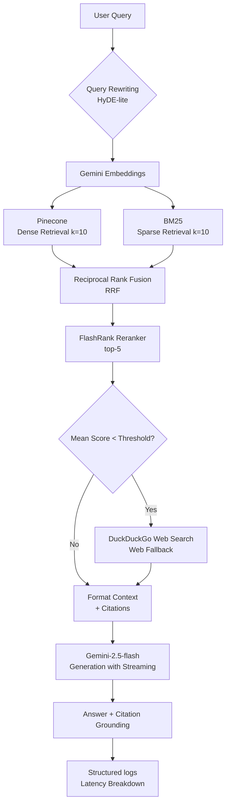

# miniRAG

> **Production-grade, modular Retrieval-Augmented Generation (RAG) system** built with Gemini, Pinecone Serverless, hybrid search (BM25 + Dense), Reciprocal Rank Fusion (RRF), Cross-Encoder reranking, and automated RAGAS evaluation.

---

## Overview

**miniRAG** is a highly optimized, modular RAG pipeline engineered for SDE and LLM engineering resumes. It showcases modern best practices in LLM orchestration, vector databases, multi-stage retrieval, observability, and automated evaluation.

### Key Architectural Layers

| Layer | Technology | Engineering Rationale |
|---|---|---|
| **Frontend** | Streamlit | Responsive dark glassmorphic UI showcasing latency breakdowns, grounding checks, and real-time streaming. |
| **Embeddings** | `gemini-embedding-001` (3072-dim) | High-dimension embeddings for capturing subtle semantic contexts. |
| **Vector Store** | Pinecone Serverless | Low-latency cloud search featuring **strict namespace isolation** to prevent data cross-contamination. |
| **Sparse Retrieval** | BM25 (`rank-bm25`) | In-memory lexical scoring to guarantee exact matches for key terms (e.g. codes, IDs, proper nouns). |
| **Rank Fusion** | Reciprocal Rank Fusion (RRF) | Merges sparse and dense candidate lists using parameter-free ranking. Resolves collisions using composite keys (`file_hash` + `chunk_id`). |
| **Reranking** | FlashRank Cross-Encoder | Local, zero-cost CPU-optimized Cross-Encoder (`ms-marco-MultiBERT-L-12`) that reduces query window sizes from 20 to 5 candidates. |
| **LLM Generation** | `gemini-2.5-flash` | Ultra-fast generation with support for live streaming and citation markers. |
| **Query Rewriting** | HyDE-lite (Gemini) | Automatically reframes vague queries into highly descriptive target passages to maximize vector retrieval recall. |
| **Web Fallback** | DuckDuckGo API | Agentic fallback mechanism that triggers a live web search if retrieval confidence scores fall below a minimum relevance threshold. |
| **Evaluation** | RAGAS Framework | Measures system performance across four key axes: Faithfulness, Answer Relevancy, Context Precision, and Context Recall. |
| **Observability** | `structlog` | Structured JSON logging providing a granular, per-stage latency breakdown. |

---

## Pipeline Architecture



---

## Advanced Features

### 1. Hybrid Search & RRF Fusion
To achieve optimal retrieval quality, miniRAG merges **Dense Search** (semantic context) and **Sparse Search** (keyword match). The fusion is managed by Reciprocal Rank Fusion (RRF) with a standard constant ($k=60$):
$$\text{Score}(d \in D) = \sum_{m \in M} \frac{1}{60 + \text{rank}_m(d)}$$
A custom **composite key** (`file_hash` + `chunk_id`) prevents document collisions during RRF fusion when processing multiple uploaded files.

### 2. Multi-Stage Reranking
To combat the "lost in the middle" LLM behavior, the pipeline routes the top 20 candidate chunks through a local CPU-bound **FlashRank Cross-Encoder**. This reranker evaluates candidate pairs directly, shrinking the context window down to the 5 most critical chunks before LLM generation.

### 3. Agentic Web Fallback
When a query targets information outside the indexed documents, retrieval confidence drops. miniRAG dynamically detects this by analyzing the relevance scores of retrieved chunks:
- If scores fall below `Config.WEB_FALLBACK_THRESHOLD` (or fewer than 2 chunks are found), the pipeline automatically triggers a fallback search using DuckDuckGo.
- This results in augmented answers without manual intervention, avoiding empty or hallucinated responses.

### 4. Citation Grounding Validation
Every generated answer is parsed for citation indicators (e.g. `[1]`, `[2]`). An automated post-processing step validates that each citation correctly maps back to a retrieved source document. Hallucinated citations trigger visual warnings in the UI to protect user trust.

---

## Installation & Setup

### Prerequisites
- **Python >= 3.11**
- **Google Gemini API Key** (Get one from [Google AI Studio](https://aistudio.google.com/))
- **Pinecone Cloud Account** (Create a free serverless index on [Pinecone Console](https://app.pinecone.io/))

### Step 1 — Create your Pinecone Index
In your Pinecone console, create an index with the following specifications:
- **Name:** `mini-rag` (or custom name configured in `.env`)
- **Dimension:** `3072` (corresponds to `gemini-embedding-001`)
- **Metric:** `cosine`
- **Cloud/Region:** AWS `us-east-1` (available on the free tier)

### Step 2 — Clone & Install Dependencies
Clone the repository and install the package. We recommend using a virtual environment.

```bash
# Clone
git clone https://github.com/sakshinaithani2005/miniRAG.git
cd miniRAG

# Virtual environment
python -m venv venv
source venv/bin/activate  # On Windows: venv\Scripts\activate

# Install the package with ALL optional modules (eval, web search, docx, and dev tools)
pip install -e ".[all]"
```

### Step 3 — Environment Configuration
Copy the template `.env` file and add your credentials:

```bash
cp .env.example .env
```

Open `.env` and configure:
```env
GOOGLE_API_KEY=your_gemini_api_key_here
PINECONE_API_KEY=your_pinecone_api_key_here
PINECONE_INDEX_NAME=mini-rag
```

---

## Running the Application

### 1. Interactive Streamlit Web App
Launch the Streamlit web dashboard to upload PDFs/text files, manage indexes, choose retrieval strategies (dense, hybrid, or MMR), and query your data.

```bash
streamlit run app.py
```
*The web UI features a customized dark theme with glassmorphism cards and live-streaming answers with detailed stage-by-stage latency breakdowns.*

### 2. Command Line Interface (CLI)
Query the RAG pipeline directly from your terminal:

```bash
# Index a PDF and query it immediately
python -m minirag.cli --query "What are attention mechanisms?" --doc attention.pdf

# Query with hybrid strategy
python -m minirag.cli --query "What is BERT?" --doc attention.pdf --strategy hybrid
```

### 3. Running with Docker
Run the application in a sandboxed container:

```bash
docker compose up --build
```
*Access the Streamlit application at `http://localhost:8501`*

---

## RAGAS Evaluation Pipeline

Evaluate the quality of your RAG pipeline objectively across standardized metrics:

```bash
# Run evaluation over the sample Q&A dataset (pre-bundled)
python eval/eval_pipeline.py

# Evaluate a specific retrieval strategy against a target PDF
python eval/eval_pipeline.py --pdf attention.pdf --strategy hybrid --output eval/results/run_stats.json
```

### Metrics Evaluated

1. **Faithfulness:** Verifies if the generated answer is strictly grounded in the retrieved context (detects hallucinations).
2. **Answer Relevancy:** Measures whether the generated response directly answers the user's question.
3. **Context Precision:** Computes the signal-to-noise ratio of the retrieved chunks.
4. **Context Recall:** Validates whether the retriever fetched all the information required to generate the ground-truth answer.

---

## Project Structure

```
miniRAG/
├── src/minirag/              # Core python package
│   ├── __init__.py           # Package initializer
│   ├── config.py             # App configurations (pydantic-settings) & validation
│   ├── document_processor.py # Load, clean, chunk, and hash source files (PDFs/txt)
│   ├── embeddings.py         # Lazy initialization of Gemini embedding models
│   ├── llm.py                # Lazy initialization of ChatGoogleGenerativeAI
│   ├── vectorstore.py        # Pinecone database client and namespace actions
│   ├── hybrid_retriever.py   # Lexical BM25 and dense embeddings rank fusion
│   ├── retriever.py          # Strategy Factory (Dense, Hybrid, MMR)
│   ├── rag_chain.py          # LCEL RAG chain, HyDE rewriting, & citation logic
│   ├── web_search.py         # DuckDuckGo fallback query execution
│   ├── observability.py      # structlog setup & latency-tracking metrics
│   └── cli.py                # Command Line Interface execution entry
│
├── tests/                    # 100% passing test suite (Pytest)
│   ├── conftest.py           # Testing configurations and mock environments
│   ├── test_config.py        # Settings validation tests
│   ├── test_document_processor.py
│   ├── test_hybrid_retriever.py
│   ├── test_rag_chain.py
│   └── test_web_search.py
│
├── eval/                     # Performance Evaluation Module
│   ├── eval_pipeline.py      # RAGAS metrics evaluator
│   └── dataset/
│       └── sample_qa.json    # Standard Q&A dataset for benchmark evaluation
│
├── app.py                    # Streamlit Web UI (dark glassmorphism dashboard)
├── pyproject.toml            # Package configuration and dependencies definitions
├── Dockerfile                # Docker setup
├── docker-compose.yml        # Multi-container local deployment
├── .pre-commit-config.yaml   # Ruff (linter) & Mypy (typecheck) pre-commit hooks
└── .github/workflows/ci.yml  # Automated GitHub Actions workflow
```

---

## Testing & Linting

Verify your local changes and ensure code quality standards:

```bash
# Run all tests with coverage reporting
pytest tests/ -v --cov=src/minirag

# Run Ruff for style checking and auto-formatting
ruff check src/ tests/

# Verify type safety
mypy src/minirag/ --ignore-missing-imports
```

---

## Configuration Properties

The following environment variables can be declared in your `.env` file to customize the RAG behavior:

| Environment Variable | Default | Description |
|---|---|---|
| `GOOGLE_API_KEY` | — | Your Gemini API Key from Google AI Studio. |
| `PINECONE_API_KEY` | — | Your Pinecone database API Key. |
| `PINECONE_INDEX_NAME` | `mini-rag` | The Pinecone index name. |
| `RETRIEVAL_STRATEGY` | `hybrid` | Default retrieval strategy (`dense`, `hybrid`, `mmr`). |
| `RETRIEVAL_TOP_K` | `10` | The number of initial candidate chunks retrieved from Pinecone/BM25. |
| `RERANK_TOP_N` | `5` | The number of chunks returned to the generator after Cross-Encoder reranking. |
| `CHUNK_SIZE` | `1000` | Target characters per chunk during text splitting. |
| `CHUNK_OVERLAP` | `200` | Overlap character length between chunks. |
| `ENABLE_QUERY_REWRITING` | `true` | Enable/Disable HyDE-lite query rewriting. |
| `ENABLE_WEB_FALLBACK` | `false` | Enable/Disable DuckDuckGo web search fallback. |
| `WEB_FALLBACK_THRESHOLD` | `0.3` | Confidence score below which web fallback search is triggered. |
| `ENABLE_LANGSMITH_TRACING`| `false` | Enable/Disable LangSmith tracing. |
| `LLM_TEMPERATURE` | `0.3` | The temperature parameter for LLM response generation. |

---

## License

Distributed under the MIT License. See [LICENSE](LICENSE) for details.
