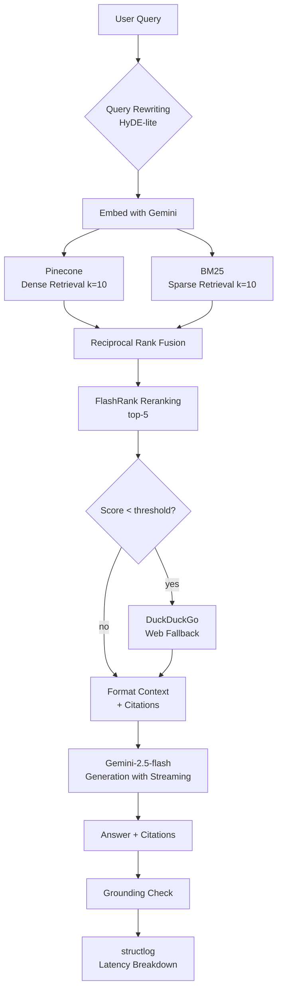

# 🧠 miniRAG

> **Production-grade Retrieval-Augmented Generation** with Gemini, Pinecone, Hybrid Search, and RAGAS Evaluation.

[](https://github.com/sakshinaithani2005/miniRAG/actions)
[](https://python.org)
[](LICENSE)
[](https://github.com/astral-sh/ruff)

---

## What Is This?

miniRAG is an end-to-end, production-ready RAG system that demonstrates every layer of the modern LLM application stack:

| Layer | Tech |
|---|---|
| **Embeddings** | `gemini-embedding-001` (3072-dim) |
| **Vector Store** | Pinecone Serverless (per-doc namespacing) |
| **Sparse Retrieval** | BM25 (`rank-bm25`) |
| **Fusion** | Reciprocal Rank Fusion (RRF) |
| **Reranking** | FlashRank (zero-cost, CPU cross-encoder) |
| **Generation** | `gemini-2.5-flash` (streaming) |
| **Query Rewriting** | HyDE-lite via Gemini |
| **Web Fallback** | DuckDuckGo (agentic retrieval) |
| **Evaluation** | RAGAS (Faithfulness, Relevancy, Precision, Recall) |
| **Observability** | structlog (JSON), per-stage latency breakdown |
| **Frontend** | Streamlit (dark glassmorphism, chat UI) |
| **CLI** | `python -m minirag.cli` |
| **Tests** | pytest + pytest-cov (≥70% coverage) |
| **CI** | GitHub Actions (lint → typecheck → test) |
| **Packaging** | Docker + docker-compose |

---

## Architecture



---

## RAG Pipeline Details

### 1. Hybrid Retrieval (BM25 + Dense + RRF)

Pure dense search misses exact keyword matches (product codes, author names, model numbers). Hybrid retrieval combines:
- **Dense**: Gemini cosine similarity — semantic understanding
- **Sparse**: BM25 — keyword precision
- **RRF**: `score = Σ 1/(60 + rank_i)` — parameter-free fusion

### 2. HyDE-lite Query Rewriting

Before hitting the vector store, vague user queries are rewritten by Gemini into precise, retrieval-optimised queries. This improves recall on conversational questions.

### 3. Answer Grounding Check

After generation, citation markers like `[1]`, `[3]` are parsed and validated against the number of context documents. Hallucinated citations surface as warnings in the UI.

### 4. RAGAS Evaluation

```bash
python eval/eval_pipeline.py --pdf attention.pdf --output eval/results/latest_eval.json
```

| Metric | Description |
|---|---|
| **Faithfulness** | Is the answer fully supported by the context? |
| **Answer Relevancy** | Does the answer address the question? |
| **Context Precision** | How much of the retrieved context is relevant? |
| **Context Recall** | Does context cover the ground-truth answer? |

---

## Setup

### Prerequisites
- Python ≥ 3.11
- [Google AI Studio API key](https://aistudio.google.com/) (free tier: 60 RPM)
- [Pinecone account](https://www.pinecone.io/) (free tier: 1M vector ops/month)

### Step 1 — Create Pinecone Index
In [Pinecone Console](https://app.pinecone.io):
- **Name**: `mini-rag`
- **Dimension**: `3072`
- **Metric**: `cosine`
- **Cloud**: AWS us-east-1 (free tier)

### Step 2 — Install

```bash
git clone https://github.com/sakshinaithani2005/miniRAG.git
cd miniRAG

python -m venv venv && source venv/bin/activate  # Windows: venv\Scripts\activate

# Core app
pip install -e .

# Optional: RAGAS evaluation
pip install -e ".[eval]"

# Optional: web search fallback
pip install -e ".[web]"

# Development (tests, linting)
pip install -e ".[dev]"
```

### Step 3 — Configure

```bash
cp .env.example .env
# Fill in:
# GOOGLE_API_KEY=...
# PINECONE_API_KEY=...
# PINECONE_INDEX_NAME=mini-rag
```

### Step 4 — Run

```bash
# Streamlit UI
streamlit run app.py

# CLI
python -m minirag.cli --query "What is attention?" --doc attention.pdf

# With a specific retrieval strategy
python -m minirag.cli -q "Explain BERT" --doc paper.pdf --strategy hybrid

# Evaluation
python eval/eval_pipeline.py --pdf attention.pdf
```

### Docker

```bash
docker compose up --build
# App available at http://localhost:8501
```

---

## Configuration

All settings live in `src/minirag/config.py` (pydantic-settings) and can be overridden via environment variables:

| Env Var | Default | Description |
|---|---|---|
| `GOOGLE_API_KEY` | — | Google AI Studio API key |
| `PINECONE_API_KEY` | — | Pinecone API key |
| `PINECONE_INDEX_NAME` | `mini-rag` | Index name |
| `RETRIEVAL_STRATEGY` | `hybrid` | `dense` / `hybrid` / `mmr` |
| `RETRIEVAL_TOP_K` | `10` | Candidates from vector DB |
| `RERANK_TOP_N` | `5` | After FlashRank reranking |
| `CHUNK_SIZE` | `1000` | Characters per chunk |
| `CHUNK_OVERLAP` | `200` | Overlap between chunks |
| `ENABLE_QUERY_REWRITING` | `true` | HyDE-lite query rewriting |
| `ENABLE_WEB_FALLBACK` | `false` | DuckDuckGo fallback |
| `ENABLE_LANGSMITH_TRACING` | `false` | LangSmith trace export |
| `LLM_TEMPERATURE` | `0.3` | Generation temperature |

---

## Development

```bash
# Run tests
pytest tests/ -v --cov=src/minirag

# Lint
ruff check src/ tests/

# Type check
mypy src/minirag/ --ignore-missing-imports

# Install pre-commit hooks (runs ruff + mypy on every commit)
pre-commit install
```

---

## Project Structure

```
miniRAG/
├── src/minirag/              # Core package
│   ├── config.py             # pydantic-settings, RetrievalStrategy enum
│   ├── embeddings.py         # Gemini embedding singleton
│   ├── llm.py                # Gemini generation singleton
│   ├── document_processor.py # Load → chunk → hash → metadata
│   ├── vectorstore.py        # Pinecone + per-namespace management
│   ├── hybrid_retriever.py   # BM25 + dense + RRF fusion
│   ├── retriever.py          # Strategy factory (dense/hybrid/mmr)
│   ├── rag_chain.py          # LCEL chain + query rewriting + citations
│   ├── web_search.py         # DuckDuckGo fallback
│   ├── observability.py      # structlog + QueryTracer
│   └── cli.py                # CLI interface
│
├── tests/                    # pytest unit tests (≥70% coverage)
│   ├── test_document_processor.py
│   ├── test_rag_chain.py
│   ├── test_hybrid_retriever.py
│   ├── test_config.py
│   └── test_web_search.py
│
├── eval/                     # RAGAS evaluation pipeline
│   ├── eval_pipeline.py      # Metrics: Faithfulness, Relevancy, Precision, Recall
│   └── dataset/
│       └── sample_qa.json    # Bundled Q/A pairs (Attention Is All You Need)
│
├── app.py                    # Streamlit UI (chat, streaming, latency breakdown)
├── pyproject.toml            # Project metadata + tool configs
├── Dockerfile                # Production Docker image
├── docker-compose.yml        # Compose for local deployment
├── .pre-commit-config.yaml   # ruff + mypy pre-commit hooks
└── .github/workflows/ci.yml  # CI: lint → typecheck → test
```

---

## Design Decisions

| Choice | Rationale |
|---|---|
| **Hybrid BM25 + dense** | Closes vocab gap; dense alone misses exact keyword matches |
| **RRF over learned fusion** | Parameter-free, robust, no training data needed |
| **FlashRank reranker** | Zero cost, ~5ms CPU cross-encoder; no extra API key |
| **Pinecone namespaces** | Isolates docs; enables multi-doc querying without index pollution |
| **pydantic-settings Config** | Single source of truth; env-var overrides; validated at startup |
| **HyDE-lite rewriting** | Improves recall for vague conversational queries |
| **structlog JSON** | Machine-parseable logs; query-level latency breakdown |
| **RAGAS eval** | Quantifiable retrieval quality — not just vibes |

---

## Cost & Performance

| Component | Cost | Latency |
|---|---|---|
| Gemini Embeddings (`gemini-embedding-001`) | Free tier: 1500 req/day | ~200ms |
| Gemini Generation (`gemini-2.5-flash`) | ~$0.075/1M tokens in | ~0.5–2s |
| Pinecone Serverless | Free tier: 1M vector ops/month | ~50ms |
| BM25 Reranking | $0 (local CPU) | <1ms |
| FlashRank Reranking | $0 (local CPU) | ~5ms |

**Typical end-to-end query cost**: ~$0.0001–0.0005

---

## License

MIT © miniRAG contributors
